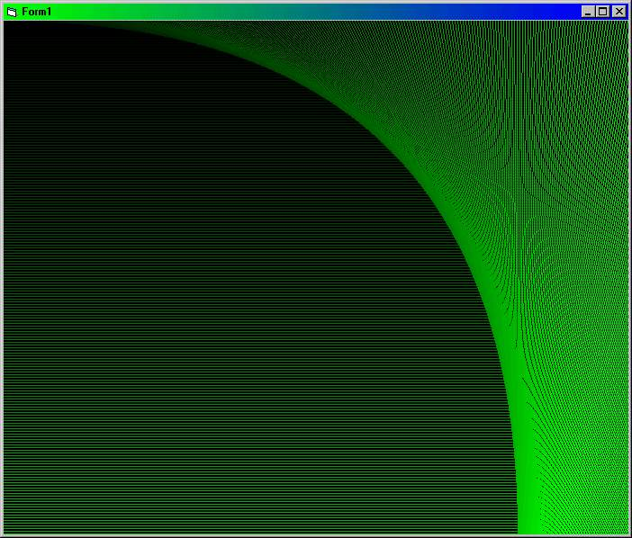

<div align="center">

## Very Cool Graphics With Lines using only 11 lines of code\!\!


</div>

### Description

This code draws a nice, very cool gradient field with a nice sidebar using line(see screenshot) Please rate it! (Thnx!).
 
### More Info
 
The only thing you need to do is to set the scalemode on the form to 'Pixel' and the backcolor to black and insert a timer called 'timer1' with interval : 1

You can set the color to draw by setting the RGB value to rgb(0,red,0) or rgb(red,0,0) etc.

You can also change the graphic resolution by changing the 'lY1 = lY1' command.


<span>             |<span>
---                |---
**Submitted On**   |
**By**             |[ReXz](https://github.com/Planet-Source-Code/PSCIndex/blob/master/ByAuthor/rexz.md)
**Level**          |Beginner
**User Rating**    |4.3 (17 globes from 4 users)
**Compatibility**  |VB 5\.0, VB 6\.0
**Category**       |[Graphics](https://github.com/Planet-Source-Code/PSCIndex/blob/master/ByCategory/graphics__1-46.md)
**World**          |[Visual Basic](https://github.com/Planet-Source-Code/PSCIndex/blob/master/ByWorld/visual-basic.md)
**Archive File**   |[](https://github.com/Planet-Source-Code/rexz-very-cool-graphics-with-lines-using-only-11-lines-of-code__1-22029/archive/master.zip)

### API Declarations

```
Dim lY1 As Integer
Dim Red As Integer
```


### Source Code

```
Private Sub Form_Load()
Red = 0
End Sub
Private Sub Timer1_Timer()
Red = Red + 1
If Red < 255 Then
Me.ForeColor = RGB(0, Red, 0)
ElseIf Red > 254 Then
End If
lY1 = lY1 + 3
Me.Line (0, lY1)-(Me.ScaleWidth, lY1)
Me.Line (ly1, 0)-(Me.ScaleHeight, lY1)
End Sub
```

